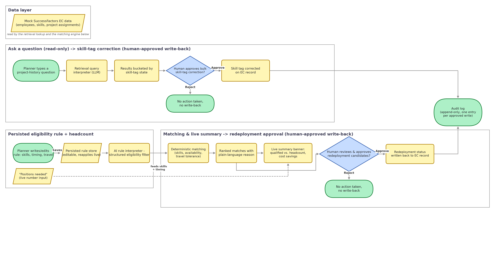

# Redeployment Decision-Support Agent

A prototype for the SAP FDPM take-home exercise: a People Ops planner authors standing,
editable eligibility rules in natural language, continuously re-applied across workforce
data, with every match traceable to the rule that produced it. Not an autonomous
decision-maker — nothing writes to an EC record without explicit human approval.

Design background and the full planning conversation: [docs/planning_transcript.md](docs/planning_transcript.md).

## Problem framing

- **32% of U.S. hiring managers eliminated a role primarily due to AI and later rehired
  for the same or similar position.** Robert Half data reported by CNBC: "Employers who
  laid off workers citing AI are already starting to regret it," CNBC, July 2026.
  https://www.cnbc.com/2026/07/01/employers-who-laid-off-workers-for-ai-are-reversing-their-decisions.html
- **Ford rehired/promoted more than 350 experienced engineers** after automated
  quality-control systems missed issues veteran engineers could catch. Same CNBC report
  above; also covered in TechSpot, "More companies are rehiring workers they replaced with
  AI after automation fails to deliver," July 2026.
  https://www.techspot.com/news/112960-more-companies-rehiring-workers-they-replaced-ai-after.html
- **Commonwealth Bank of Australia laid off 40+ customer service staff, replaced them with
  an AI voice bot, then reversed the cuts** after the bot couldn't handle real customer
  volume/complexity. Same CNBC/TechSpot coverage above.
- **Gartner forecasts that by 2027, half of companies that attributed headcount cuts to AI
  will rehire staff for similar work,** often under a different title. Cited in IBTimes UK,
  "AI Layoffs Backfire as 32% of Bosses Rehire Roles They Thought Robots Could Do," July
  2026. https://www.ibtimes.co.uk/ai-layoffs-reversed-companies-rehire-staff-1806357
- **About 5.3% of laid-off employees are eventually rehired by the same organization** — a
  rate that's held steady for years, not a new AI-era phenomenon. Visier analysis of 2.4
  million employees across 142 organizations: "The True Cost of Layoff Boomerangs,"
  Visier, 2026. https://www.visier.com/blog/true-cost-layoff-boomerangs/ — also covered
  independently in Fast Company, "Why companies hire back people they just laid off," Dec
  2025. https://www.fastcompany.com/91447602/why-companies-hire-back-people-they-just-laid-off
  - The Visier researcher's framing, as characterized in the Fast Company piece: rehiring
    after layoffs reflects a failure of workforce planning and long-term strategic
    thinking, not just an AI story.
- **3-5x cost multiplier (external hire vs. internal redeployment):** originates with **the
  Josh Bersin Company (2023)** — external hiring costs 3-5x more than internal placement
  once sourcing, interviewing, onboarding, and ramp-up are factored in. Cited secondhand in
  "Internal Mobility: How to Fill Roles With Existing Talent," Pin, 2026.
  https://www.pin.com/blog/internal-mobility-hiring/ This is a secondary citation of
  Bersin's original research rather than the primary study itself. The multiplier
  originates with Josh Bersin Company, not McKinsey; McKinsey's contribution to this
  problem framing is the strategic-tradeoff argument cited separately below.
- **McKinsey's framing** — leaders should weigh the time/cost tradeoff of internal
  redeployment vs. external hiring, and that strategic workforce planning enables more
  rapid redeployment, moving organizations away from traditional hire-fire cycles toward
  sustainable through-cycle capacity management. "The critical role of strategic workforce
  planning in the age of AI," McKinsey & Company.
  https://www.mckinsey.com/capabilities/people-and-organizational-performance/our-insights/the-critical-role-of-strategic-workforce-planning-in-the-age-of-ai
- **External-hire cost-per-hire baseline: $5,475 (non-executive).** SHRM 2025 Benchmarking
  Report, non-executive cost-per-hire benchmark. Note: the commonly-cited $4,700
  figure is from an older SHRM benchmarking cycle and is now outdated — not used here.

**Source quality note:** Pin and similarly-positioned industry blogs are vendor content
with a commercial interest in how the internal-mobility problem is framed. CNBC/Robert
Half, Visier, and McKinsey are independent or primary-research sources and carry more
evidentiary weight.

## Architecture

Mock EC data → Deterministic scorer → NL rule interpreter (Anthropic API call) →
Explanation/output layer, with a SQLite rule-store sidecar persisting rules between runs.



- **Deterministic scorer** (`src/scorer.py`): pure logic, no LLM. Exact-string skill
  matching and availability-window checks on structured fields.
- **NL rule interpreter** (`src/rule_interpreter.py`): Anthropic API call translating a
  typed rule into a structured JSON eligibility filter, applied before the scorer runs.
  Also supports a separate one-shot NL retrieval query mode (project-history lookup) that
  never persists to the rule store.
- **Explanation layer** (`src/explain.py`): one-line reason per match/exclusion.
- **Rule store** (`src/rule_store.py`): SQLite sidecar, versioned, active rule persists
  between runs.
- **Write-back** (`src/writeback.py`): human-approved writes only — `apply_writeback` for
  redeployment status, `correct_skill_tag` for manual data-quality corrections — both
  append to an audit log and never fabricate a log entry for a no-op or unmatched ID.

## Data model

Mock SuccessFactors EC data, deliberately imperfect. `project_assignments` and the
`travel_preference` field are flagged as custom MDF objects/fields, not out-of-the-box EC.
Three deliberate data-quality issues are injected into ~100 mock employees (see
`data/generate_mock_data.py`): missing skill tags (5 employees), inconsistent tag spelling
("Rust" / "Rust programming" / "RUST", 5 employees), and stale tags — a skill tag present
despite no matching project work in 18+ months (5 employees).

## Demo flow

The app has two side-by-side boxes at the top, plus a Candidate Matches / Summary tab pair
below them.

1. **Ask a question** (left box) — a one-shot, read-only natural-language lookup against
   project history (e.g. "who worked on Project Falcon?"). Never touches the persisted rule.
   Results are bucketed by current skill-tag state (`Skills: Rust`, `Skills: empty`,
   `Skills: other`), and a bulk "Add 'Rust' skill tag to all N in this group" button lets a
   human approve corrections for an entire non-clean bucket at once, logged to the audit trail.
2. **Eligibility rule** (right box) — a free-text standing rule, e.g. "must know Rust, be
   available within 30 days, and not mind more travel." All eligibility criteria — required
   skills, timing, and travel tolerance — come entirely from what's typed here; nothing is
   pre-baked into the mock position data. Click Save to persist it; it's re-applied live as
   corrections land.
3. **Candidate Matches / Summary tabs** — Candidate Matches lists every candidate with a
   plain-language match or exclusion reason, a per-employee lookup, and an "Approve
   write-back" step requiring explicit selection (nothing is pre-selected). Summary shows
   qualified-candidate count vs. headcount, slots with no confident match, and an estimated
   cost-avoidance figure.

## Evaluation

A hand-labeled golden set of 10 matches (`data/golden_set.json`), labeled independently
by the exercise author — not derived from the agent's own output — with both positive
examples (`expected_match: true`, people who genuinely should match) and negative
examples (`expected_match: false`, people who genuinely shouldn't), each with a written
reason. `src/eval.py` computes two metrics against this set: **positive precision@3**
(of the true matches, what fraction land in the scorer's top-3 ranked candidates — the
criterion specified in the original build spec) and **negative exclusion rate** (of the
true non-matches, what fraction the system correctly excludes). Run it with
`./venv/bin/python -m src.run_eval`, which exercises the full pipeline — deterministic
scorer plus the persisted eligibility rule — the same way `app.py` does.

**Actual result:** negative exclusion rate is **1.0** — the system correctly excludes
every person the human judged as a non-match (travel-rule violations, late availability).
Positive precision@3 is **0.17** (1 of 6), which reads poorly in isolation but is a
metric-window artifact, not a system error: `run_eval.py`'s diagnostic output confirms
all 6 true matches are present in the eligible candidate pool (100% correct eligibility),
just not all within the top 3 ranked slots — expected, since the position needs 10 hires
(`headcount_needed: 10`) with 11 people eligible, so at most 3 of 6 valid matches can ever
occupy the top-3 window at once. This is exactly the kind of result the take-home's
evaluation criterion is meant to surface: a single precision number without context can
mislead, and a credible eval should be able to explain, not just report, its own numbers.

## Assumptions and tradeoffs

The Summary tab's cost-avoidance estimate is: `fillable slots × $5,475 baseline (SHRM 2025
Benchmarking Report) × 3`, where "fillable slots" is the qualified-candidate count capped at
the position's headcount (you can only fill the open slots), and 3 is the *marginal* savings
implied by the cited 3-5x external-hire-cost multiplier (midpoint 4x) — i.e. if an external
hire costs 4x the baseline and an internal redeployment costs roughly 1x the baseline, the
amount actually *avoided* by redeploying is the difference, `(4 - 1) = 3` times the baseline,
not the full 4x. The qualified-candidate count itself is shown uncapped elsewhere on the tab
("Qualified candidates: N for M positions") so a true count above headcount isn't hidden.
This baseline is also an across-industry, across-role-type average — a specialized technical
hire (Rust engineer) likely costs more once longer sourcing/vetting time is factored in.
Treat the resulting figure as a conservative estimate, not a precise one for this specific
role type.

The Summary tab is scoped to the one open position (P001) the demo's eligibility rule is
about — it does not aggregate or deduplicate across multiple positions.

## Non-goals (explicit scope boundaries)

- No entity-resolution/normalization engine for inconsistent skill tags — corrections are
  manual, one person at a time, human-approved.
- No support for partial/simultaneous project allocation — hard stop dates only.
- No custom-field admin UI for configuring MDF fields like `travel_preference`.
- No staleness checking on skill tags: some employees have a `Rust` tag despite no Rust
  project work in 18+ months, and the deterministic scorer treats them as skill-eligible
  regardless. A production system would need to validate skill tags against recency of use,
  not just presence.

## Running it

Requires Python 3.10+ and your own Anthropic API key (get one at
[console.anthropic.com](https://console.anthropic.com/) — the app runs and the deterministic
scorer/data views work without one, but the two LLM-backed features (the persisted
eligibility rule and the one-shot retrieval query) require it, and degrade to a warning
message rather than crashing if it's missing).

**First-time setup:**

1. Create a virtual environment and install dependencies:
   ```
   python3 -m venv venv
   ./venv/bin/pip install -r requirements.txt
   ```
2. Copy `.env.example` to `.env` and add your own `ANTHROPIC_API_KEY`.
3. Generate the mock dataset: `./venv/bin/python data/generate_mock_data.py`

**Every time you want to run it:**

- `./run_demo.sh` — starts the app and opens it in Chrome. Ctrl+C in the terminal stops the
  server. (Or run `./venv/bin/streamlit run app.py` directly if you don't use Chrome.)
- `./reset_demo.py` — resets `data/employees.json` to its committed state and clears
  `rules.db`/`audit_log.jsonl`, so a previous practice run's skill-tag corrections, saved
  rule, and write-backs don't carry into the next one.

Run the test suite: `./venv/bin/python -m pytest`

## Sources

- **32% of U.S. hiring managers eliminated a role primarily due to AI and later rehired for
  the same or similar position.** Robert Half data reported by CNBC: "Employers who laid
  off workers citing AI are already starting to regret it," CNBC, July 2026.
  https://www.cnbc.com/2026/07/01/employers-who-laid-off-workers-for-ai-are-reversing-their-decisions.html
- **Ford rehired/promoted more than 350 experienced engineers** after automated
  quality-control systems missed issues veteran engineers could catch. Same CNBC report
  above; also covered in TechSpot, "More companies are rehiring workers they replaced with
  AI after automation fails to deliver," July 2026.
  https://www.techspot.com/news/112960-more-companies-rehiring-workers-they-replaced-ai-after.html
- **Commonwealth Bank of Australia laid off 40+ customer service staff, replaced them with
  an AI voice bot, then reversed the cuts** after the bot couldn't handle real customer
  volume/complexity. Same CNBC/TechSpot coverage above.
- **Gartner forecasts that by 2027, half of companies that attributed headcount cuts to AI
  will rehire staff for similar work,** often under a different title. Cited in IBTimes UK,
  "AI Layoffs Backfire as 32% of Bosses Rehire Roles They Thought Robots Could Do," July
  2026. https://www.ibtimes.co.uk/ai-layoffs-reversed-companies-rehire-staff-1806357
- **About 5.3% of laid-off employees are eventually rehired by the same organization** — a
  rate that's held steady for years, not a new AI-era phenomenon. Visier analysis of 2.4
  million employees across 142 organizations: "The True Cost of Layoff Boomerangs,"
  Visier, 2026. https://www.visier.com/blog/true-cost-layoff-boomerangs/ — also covered
  independently in Fast Company, "Why companies hire back people they just laid off," Dec
  2025. https://www.fastcompany.com/91447602/why-companies-hire-back-people-they-just-laid-off
  - The Visier researcher's framing, as characterized in the Fast Company piece: rehiring
    after layoffs reflects a failure of workforce planning and long-term strategic
    thinking, not just an AI story.
- **3-5x cost multiplier (external hire vs. internal redeployment):** originates with **the
  Josh Bersin Company (2023)** — external hiring costs 3-5x more than internal placement
  once sourcing, interviewing, onboarding, and ramp-up are factored in. Cited secondhand in
  "Internal Mobility: How to Fill Roles With Existing Talent," Pin, 2026.
  https://www.pin.com/blog/internal-mobility-hiring/ This is a secondary citation of
  Bersin's original research rather than the primary study itself. The multiplier
  originates with Josh Bersin Company, not McKinsey; McKinsey's contribution to this
  problem framing is the strategic-tradeoff argument cited separately below.
- **McKinsey's framing** — leaders should weigh the time/cost tradeoff of internal
  redeployment vs. external hiring, and that strategic workforce planning enables more
  rapid redeployment, moving organizations away from traditional hire-fire cycles toward
  sustainable through-cycle capacity management. "The critical role of strategic workforce
  planning in the age of AI," McKinsey & Company.
  https://www.mckinsey.com/capabilities/people-and-organizational-performance/our-insights/the-critical-role-of-strategic-workforce-planning-in-the-age-of-ai
- **External-hire cost-per-hire baseline: $5,475 (non-executive).** SHRM 2025 Benchmarking
  Report, non-executive cost-per-hire benchmark. Note: the commonly-cited $4,700 figure is
  from an older SHRM benchmarking cycle and is now outdated — do not use it. See "Assumptions
  and tradeoffs" above for how this baseline and the Bersin multiplier combine into the
  scale view's cost-avoidance figure.

**Source quality note:** Pin and similarly-positioned industry blogs are vendor content
with a commercial interest in how the internal-mobility problem is framed. CNBC/Robert
Half, Visier, and McKinsey are independent or primary-research sources and carry more
evidentiary weight.
